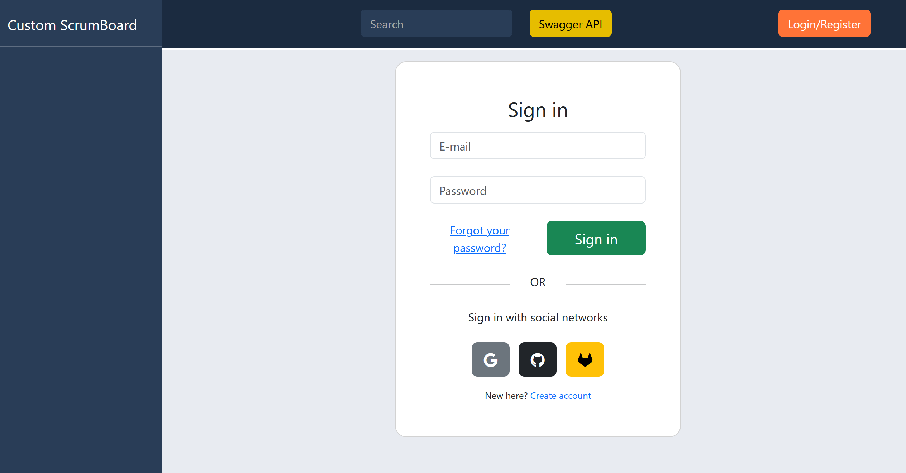
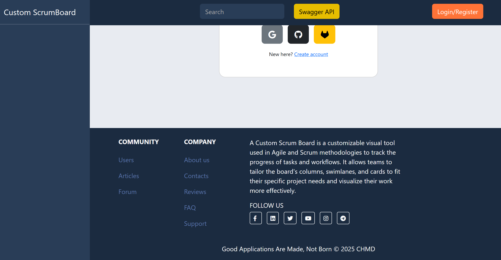
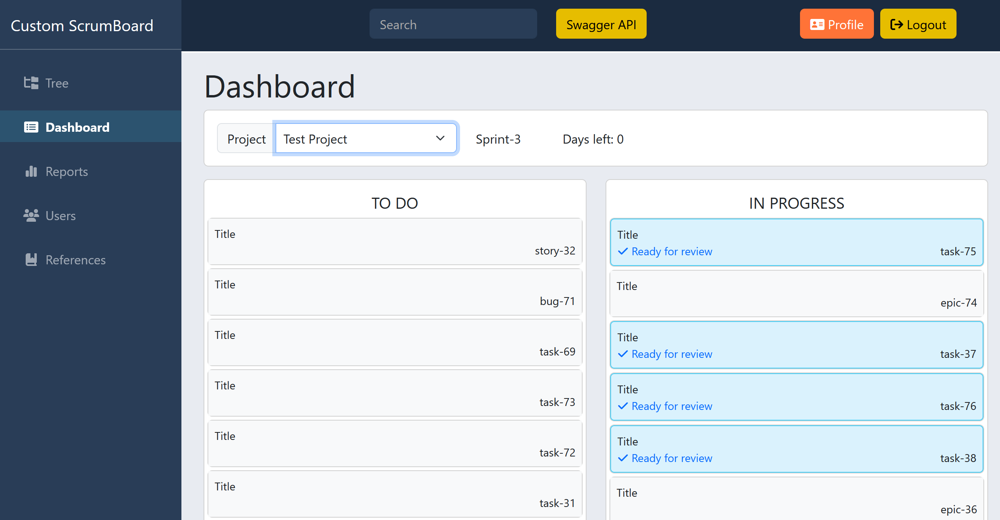
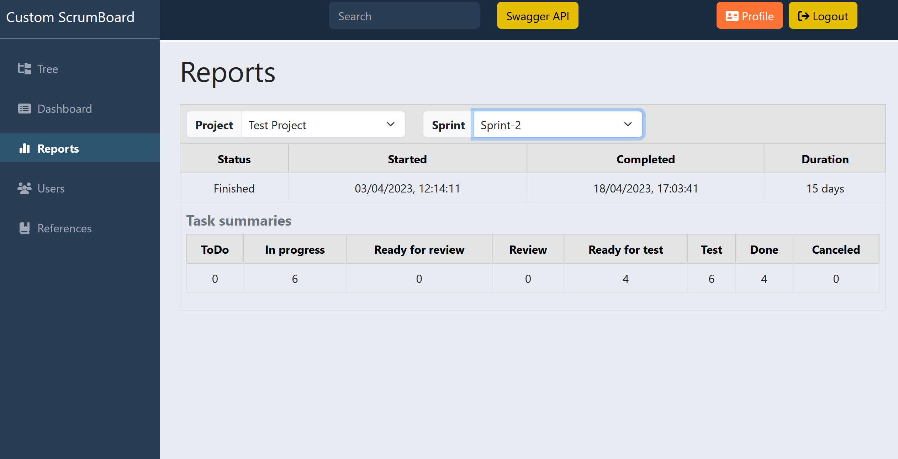

Custom ScrumBoard

Lightweight tool that generates printable task cards for physical Scrum boards. It integrates with Team Foundation Server (TFS) and Azure DevOps to fetch work items and export them as neatly designed PDF cards. 
Ideal for teams who prefer a hands-on approach to sprint planning and task tracking.

It's a robust application that integrates:
Data persistence (JPA) with PostgreSQL and Liquibase for database schema management.\
Security (Spring Security) and OAuth2 authentication.\
Web functionalities (RESTful APIs) and validation.\
Swagger/OpenAPI integration for API documentation.\
Caching support (Caffeine) for performance.\
Email capabilities and view generation (Thymeleaf).\
Utilizes Lombok and MapStruct for reducing boilerplate code and object mapping.\
Includes testing support (Spring Security Test, JUnit).

In short, it's a modern, full-featured application focused on Scrum project management, with a Spring Boot-based architecture, designed for scalability and maintainability.

TO RUN THE PROJECT, YOU NEED TO CREATE A .env FILE IN THE PROJECT ROOT WITH THE FOLLOWING CONTENT:

DB_URL= URL for connecting to the database
DB_USERNAME= username for connecting to the database
DB_PASSWORD= password for connecting to the database
GH_CLIENT_ID= GitHub ID for connecting to GitHub
GH_CLIENT_SECRET= password for connecting to GitHub
GOOGLE_CLIENT_ID= client ID for connecting to Google
GOOGLE_CLIENT_SECRET= password for connecting to Google
GITLAB_CLIENT_ID= GitLab ID for connecting to GitLab
GITLAB_CLIENT_SECRET= password for connecting to GitLab
MAIL_HOST= host for email
MAIL_USERNAME= login for email
MAIL_PASSWORD= password for email

The dotenv-java library will automatically load these environment variables when the application starts.

After that run docker-compose up to start the DB using \
docker-compose build\
docker-compose up -d

When DB is up and running, you can run the application using: CustomScrumBoardApplication

Autentication is done using OAuth2, so you need to register your application with GitHub, Google, and GitLab to get the client IDs and secrets.\

The bottom section of the application, or footer, 
is set against a dark background and serves as a comprehensive resource hub. It's clearly divided into three main columns and a copyright notice.

The "Dashboard" page serves as the central interface for visualizing and managing project progress in a Scrum-specific manner. Its design is clean and functional, 
emphasizing clarity and quick access to essential information.
The dashboard is designed to provide a quick and intuitive overview of the project's status and sprint progress. By displaying items 
in distinct columns ("TO DO," "IN PROGRESS") and using status indicators ("Days left: 0," "Ready for review"), 
it allows team members and managers to grasp the project's state and what needs attention at a glance. It is clearly a tool focused on productivity 
and transparency within Agile methodologies.

The "Reports" page is dedicated to visualizing project and sprint performance, offering an analytical perspective on work progress. 
It's a crucial section for project managers and teams who want to evaluate efficiency and identify trends.

